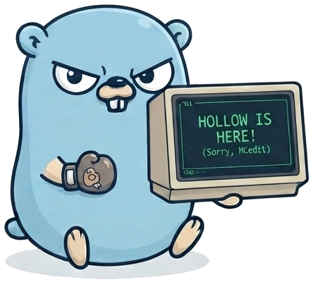
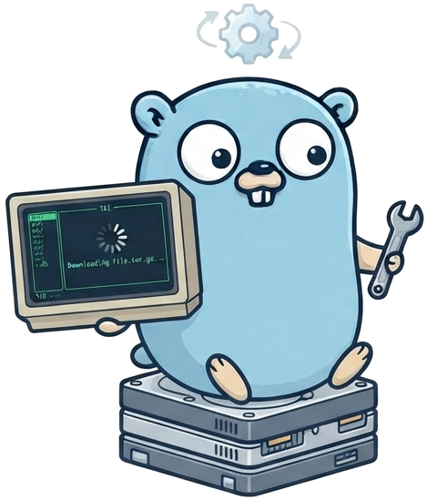
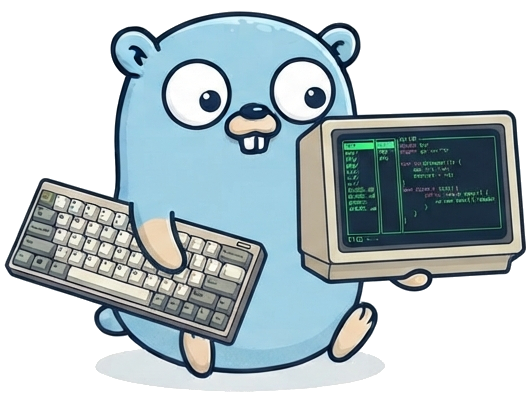
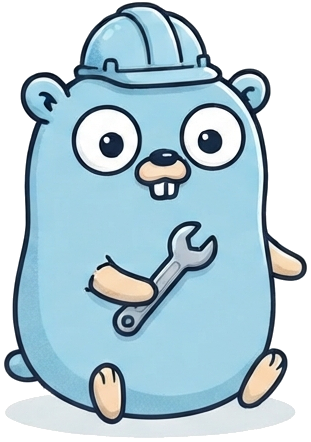

# Hollow



**Hollow** est un explorateur de fichiers et un éditeur de texte TUI écrit en Go. Il combine la simplicité de **Nano**, l'efficacité de **Midnight Commander** et la possibilité de travailler sur des fichiers locaux ou distants depuis un seul terminal.

Le projet est développé avec l'aide de l'IA dans un but récréatif, pédagogique et formateur.

<br clear="left">

## Ce que Hollow permet

- Parcourir des fichiers locaux, FTP, FTPS et SFTP dans une interface à double panneau.
- Ouvrir et modifier des fichiers directement depuis l'explorateur.
- Charger les répertoires en arrière-plan pour garder une interface réactive, même sur un réseau lent.
- Naviguer dans les archives `.zip`, `.tar` et `.tar.gz`, puis en extraire le contenu.
- Copier des fichiers entre panneaux, renommer des éléments et créer des liens symboliques.
- Modifier les permissions, propriétaires et groupes avec `chmod` et `chown`.
- Détecter les fichiers binaires avant de tenter de les afficher dans l'éditeur.
- Enregistrer des dossiers favoris et retrouver rapidement un chemin avec le fuzzy finder.
- Afficher une aide contextuelle adaptée au mode courant avec `F1`.

## Documentation

Pour la documentation technique complète, voir [DOC.md](DOC.md).

## Installation rapide



Sur Linux, installer la dernière version précompilée sans installer Go :

```bash
curl -sL https://raw.githubusercontent.com/EducLecomte/hollow/main/install.sh | bash
```

Depuis une copie locale du projet :

```bash
chmod +x install.sh
./install.sh
```

### Alpine Linux

Pour compiler un binaire statique compatible avec `musl` :

```bash
apk add --no-cache go git bash curl wget
git clone https://github.com/EducLecomte/hollow.git
cd hollow
CGO_ENABLED=0 go build -trimpath -ldflags="-s -w" -o /usr/local/bin/hollow ./cmd/hollow
```

Ou installer automatiquement la dernière release :

```bash
apk add --no-cache curl
curl -fsSL https://raw.githubusercontent.com/EducLecomte/hollow/main/install-alpine.sh | sh
```

Les releases Linux sont disponibles en `amd64` et `arm64`. Le terminal doit disposer d'un TTY.

## Utilisation



```bash
# Ouvrir le répertoire courant
hollow

# Ouvrir un répertoire précis
hollow internal/app

# Éditer un fichier existant ou nouveau
hollow README.md
```

## Raccourcis

### Explorateur

| Touche | Action |
| :--- | :--- |
| `F1` | Afficher l'aide contextuelle |
| `F3` | Se connecter en FTP, FTPS ou SFTP |
| `F4` | Extraire une archive vers l'autre panneau |
| `F5` | Créer un lien symbolique (`ln -s`) |
| `F6` | Modifier les permissions et propriétaires |
| `F7` | Créer un fichier ou un dossier |
| `F8` | Activer le double panneau ou copier l'élément sélectionné vers l'autre panneau |
| `Tab` / `Shift + Tab` | Changer de panneau ou passer au visualiseur |
| `Ctrl + B` | Afficher ou masquer les favoris |
| `Ctrl + D` | Ajouter ou retirer le dossier courant des favoris |
| `Ctrl + F` | Rechercher dans l'arborescence |
| `Ctrl + K` / `Ctrl + U` | Préparer puis coller une copie de l'élément sélectionné |
| `Ctrl + R` | Renommer le fichier ou dossier sélectionné |
| `Entrée` | Ouvrir un fichier, dossier ou archive |
| `Suppr` | Supprimer l'élément sélectionné |
| `Ctrl + X` | Quitter Hollow |



### Éditeur

| Touche | Action |
| :--- | :--- |
| `F1` | Afficher l'aide contextuelle |
| `Ctrl + S` | Sauvegarder |
| `Ctrl + F` | Rechercher dans le fichier |
| `Ctrl + K` | Couper la ligne courante |
| `Ctrl + U` | Coller les lignes coupées |
| `Esc` / `Ctrl + X` | Fermer l'éditeur |

## Architecture


L'abstraction de système de fichiers (**VFS**) de `internal/vfs/` sépare les protocoles de la logique de l'interface. Elle permet de gérer les systèmes local, FTP, FTPS, SFTP et les archives sans dupliquer le comportement de l'application.

Le code de l'interface se trouve dans `internal/app/`, tandis que le point d'entrée est dans `cmd/hollow/`.

## Contribuer


Les idées, retours et contributions sont les bienvenus. 