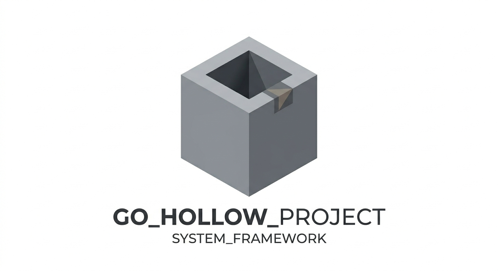
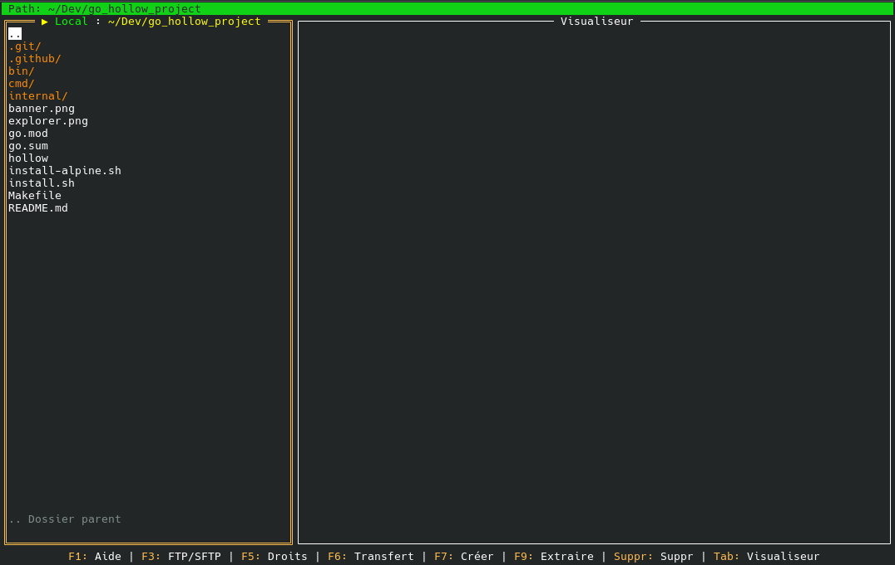

# Hollow



**Hollow** est un éditeur de texte TUI (Terminal User Interface) moderne et ultra-fluide écrit en Go. Il fusionne la simplicité d'utilisation de **Nano** avec la puissance de navigation et de gestion de fichiers distants inspirée de **mcedit** (Midnight Commander).

Ce projet est développé avec une IA, dans un but récréatif et pédagogique.

## Aperçu


*L'explorateur de fichiers avec navigation asynchrone et client FTP intégré.*

## Fonctionnalités Clés

- **Explorateur de fichiers multi-protocoles** : Navigation fluide dans l'arborescence locale et distante (FTP, FTPS, SFTP) avec tri automatique (dossiers en premier, puis fichiers).
- **Architecture Asynchrone** : Chargement des fichiers en arrière-plan avec système d'annulation intelligent (Context). L'interface ne "gèle" jamais, même sur des connexions réseaux lentes.
- **Client Réseau Sécurisé Intégré** : Connectez-vous à des serveurs distants (via `F3`) en FTP, FTPS ou SFTP, et éditez vos fichiers comme s'ils étaient sur votre disque.
- **Gestion des droits (Chmod/Chown)** : Modifiez les permissions, les propriétaires et groupes directement depuis l'explorateur (via `F5`), avec support de la récursivité locale et de la modification distante (SFTP).
- **Sécurité et Robustesse** : Détection automatique des fichiers binaires (images, exécutables) avec avertissements pour éviter les affichages illisibles ou les plantages.
- **Explorateur d'archives** : Navigation transparente et extraction à la volée du contenu des fichiers `.zip`, `.tar` et `.tar.gz`.
- **Éditeur de texte** : Mode plein écran, numérotation des lignes, recherche textuelle (`Ctrl+F`), et raccourcis de copier-coller classiques (façon Nano).
- **Barre latérale des Favoris** : Enregistrez vos dossiers fréquents et accédez-y instantanément via une barre latérale rétractable (`Ctrl+B`).
- **Aide Contextuelle Dynamique** : Appuyez sur `F1` à tout moment pour voir les raccourcis spécifiques au mode actuel.

## Prochaine release

- Refonte des raccourcis de navigation avec des touches de fonction plus accessibles : `F1`, `F3`, `F5`, `F7` et `F9`.
- Création des fichiers et dossiers regroupée dans une seule commande via `F7`.
- Recherche globale accessible via `Ctrl+F` dans l'explorateur, tandis que ce raccourci conserve la recherche dans l'éditeur.
- Gestion des favoris déplacée vers `Ctrl+D`.
- Suppression déclenchée uniquement par `Suppr` dans l'explorateur et les favoris.
- Aide contextuelle et documentation alignées sur ces nouveaux raccourcis.

## Architecture Technique

Le projet repose sur une abstraction puissante du système de fichiers (**VFS**) située dans `internal/vfs/`, permettant d'ajouter facilement de nouveaux protocoles (SFTP, S3, etc.) sans toucher à la logique de l'interface utilisateur.

## Raccourcis Clavier

### Navigation (Mode par défaut & Double Panneau)
| Touche | Action |
| :--- | :--- |
| `F1` | Aide contextuelle (adaptée au mode actif) |
| `F3` | Connexion réseau (**FTP / FTPS / SFTP**) : active automatiquement le double panneau (Local ↔ Distant) |
| `F5` | Modifier les permissions (Chmod / Chown) |
| `F6` | **Mode Transfert** : active le double panneau en local, ou transfère l'élément sélectionné vers l'autre panneau |
| `Shift + F6` | Transférer depuis l'autre panneau vers le panneau actif |
| `F7` | Créer un fichier ou un dossier dans le panneau actif |
| `F9` | Extraire une archive vers le panneau opposé |
| `TAB` / `Shift + TAB` | Passer au **Visualiseur** (mode par défaut) ou basculer entre **panneau gauche / droit** (mode double panneau / FTP) |
| `Ctrl + B` | Afficher / Masquer la barre latérale des Favoris |
| `Ctrl + D` | Ajouter / Retirer le dossier courant des favoris |
| `Ctrl + F` | Recherche Globale (Fuzzy Finder sur tout le disque) |
| `Ctrl + K` / `Ctrl + U` | Copier / Coller le chemin d'un élément |
| `Ctrl + X` | Quitter Hollow (demande confirmation) |
| `Entrée` | Ouvrir un fichier (éditeur) ou entrer dans un dossier / archive |
| `Suppr` | Supprimer l'élément sélectionné dans le panneau actif |
| `1-9` | Accès rapide direct aux favoris (Home & Racine par défaut) |
| `Ctrl + N` | Renommer le favori sélectionné |

### Édition (Éditeur Plein Écran)
| Touche | Action |
| :--- | :--- |
| `F1` | Aide contextuelle (Édition) |
| `Ctrl + S` | Sauvegarder les modifications |
| `Ctrl + F` | Rechercher dans le texte (Suivant avec Entrée) |
| `Ctrl + K` | Couper la ligne actuelle (Nano-style, concatène si répété) |
| `Ctrl + U` | Coller le bloc de lignes coupé |
| `Esc` / `Ctrl + X` | Fermer l'éditeur (confirmation si non sauvegardé) |

## Installation & Utilisation

### Prérequis
- `curl` et `wget` (pour l'installation rapide)

### Lancement
Hollow peut être lancé dans le répertoire courant ou en lui passant un chemin (fichier ou dossier) en argument de ligne de commande :
```bash
# Lancement classique (ouvre le dossier de travail actuel)
hollow

# Ouverture directe d'un répertoire spécifique
hollow internal/app

# Édition directe d'un fichier (existant ou nouveau)
hollow README.md
```

### Installation (Utilisateurs)
Pour installer la version native pré-compilée sur Linux (Debian, Ubuntu, Kali, etc.) sans avoir besoin de Go :

```bash
curl -sL https://raw.githubusercontent.com/EducLecomte/go_hollow_project/main/install.sh | bash
```

Ou via le script local si vous avez déjà cloné le projet :
```bash
chmod +x install.sh
./install.sh
```

### Installation sur Alpine Linux

Hollow peut être utilisé dans Alpine Linux, notamment dans un conteneur LXC. Pour compiler depuis les sources :

```bash
apk add --no-cache go git bash curl wget
git clone https://github.com/EducLecomte/go_hollow_project.git
cd go_hollow_project
CGO_ENABLED=0 go build -trimpath -ldflags="-s -w" -o /usr/local/bin/hollow ./cmd/hollow
hollow --version
```

`CGO_ENABLED=0` produit un binaire statique compatible avec la bibliothèque `musl` utilisée par Alpine. Les releases Linux existent en versions `amd64` et `arm64` ; choisissez l'architecture correspondant à votre conteneur.

Pour installer automatiquement la dernière release sans compiler :

```bash
apk add --no-cache curl
curl -fsSL https://raw.githubusercontent.com/EducLecomte/go_hollow_project/main/install-alpine.sh | sh
```

Pour installer une version précise :

```bash
curl -fsSL https://raw.githubusercontent.com/EducLecomte/go_hollow_project/main/install-alpine.sh | sh -s -- v1.2.0
```

Le script accepte aussi `wget` à la place de `curl`, détecte `amd64` ou `arm64`, et utilise `doas` ou `sudo` si nécessaire. L'application doit être lancée depuis un terminal disposant d'un TTY.

---
*Documentation mise à jour le 12 Septembre 2026 pour la prochaine release.*