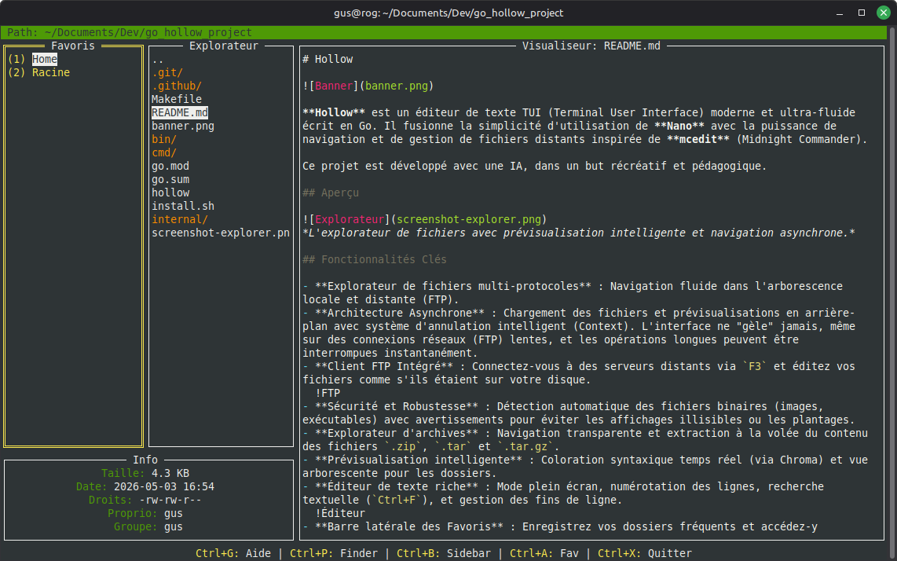

# Hollow


**Hollow** est un éditeur de texte TUI (Terminal User Interface) moderne et ultra-fluide écrit en Go. Il fusionne la simplicité d'utilisation de **Nano** avec la puissance de navigation et de gestion de fichiers distants inspirée de **mcedit** (Midnight Commander).

Ce projet est développé avec une IA, dans un but récréatif et pédagogique.

## Aperçu


*L'explorateur de fichiers avec navigation asynchrone et client FTP intégré.*

## Fonctionnalités Clés

- **Explorateur de fichiers multi-protocoles** : Navigation fluide dans l'arborescence locale et distante (FTP, FTPS, SFTP) avec tri automatique (dossiers en premier, puis fichiers).
- **Architecture Asynchrone** : Chargement des fichiers en arrière-plan avec système d'annulation intelligent (Context). L'interface ne "gèle" jamais, même sur des connexions réseaux lentes.
- **Client Réseau Sécurisé Intégré** : Connectez-vous à des serveurs distants (via `Ctrl+T`) en FTP, FTPS ou SFTP, et éditez vos fichiers comme s'ils étaient sur votre disque.
- **Gestion des droits (Chmod/Chown)** : Modifiez les permissions, les propriétaires et groupes directement depuis l'explorateur (via `Ctrl+O`), avec support de la récursivité locale et de la modification distante (SFTP).
- **Sécurité et Robustesse** : Détection automatique des fichiers binaires (images, exécutables) avec avertissements pour éviter les affichages illisibles ou les plantages.
- **Explorateur d'archives** : Navigation transparente et extraction à la volée du contenu des fichiers `.zip`, `.tar` et `.tar.gz`.
- **Éditeur de texte** : Mode plein écran, numérotation des lignes, recherche textuelle (`Ctrl+F`), et raccourcis de copier-coller classiques (façon Nano).
- **Barre latérale des Favoris** : Enregistrez vos dossiers fréquents et accédez-y instantanément via une barre latérale rétractable (`Ctrl+B`).
- **Aide Contextuelle Dynamique** : Appuyez sur `Ctrl+G` à tout moment pour voir les raccourcis spécifiques au mode actuel.

## Architecture Technique

Le projet repose sur une abstraction puissante du système de fichiers (**VFS**) située dans `internal/vfs/`, permettant d'ajouter facilement de nouveaux protocoles (SFTP, S3, etc.) sans toucher à la logique de l'interface utilisateur.

## Raccourcis Clavier

### Navigation (Explorateur / Visualiseur / Favoris)
| Touche | Action |
| :--- | :--- |
| `Ctrl + G` | Aide contextuelle (adaptée au panneau actif) |
| `Ctrl + T` | Ouvrir le dialogue de connexion réseau (FTP, FTPS, SFTP) |
| `Ctrl + B` | Afficher / Masquer la barre latérale des Favoris |
| `TAB` | Passer au panneau suivant (Favoris → Explorateur → Visualiseur) |
| `Shift + TAB` | Passer au panneau précédent (cycle inverse) |
| `Entrée` | Ouvrir un fichier ou entrer dans un dossier / archive |
| `Ctrl + A` | Ajouter / Retirer le dossier courant des favoris |
| `Ctrl + P` | Recherche Globale (Fuzzy Finder sur tout le disque) |
| `1-9` | Accès rapide direct aux favoris (Home & Racine par défaut) |
| `Ctrl + N` | Renommer le favori sélectionné |
| `Ctrl + F` | Créer un nouveau fichier |
| `Ctrl + D` | Créer un nouveau dossier |
| `Ctrl + O` | Modifier les permissions (Chmod / Chown - local et SFTP) |
| `Ctrl + R` / `Suppr` | Supprimer l'élément sélectionné dans l'explorateur ou les favoris |
| `Ctrl + E` | Extraire une archive (ou un fichier d'une archive) |
| `Ctrl + K` / `Ctrl + U` | Copier / Coller un élément |
| `Ctrl + X` | Quitter Hollow (demande confirmation) |

### Édition (Éditeur Plein Écran)
| Touche | Action |
| :--- | :--- |
| `Ctrl + G` | Aide contextuelle (Édition) |
| `Ctrl + S` | Sauvegarder les modifications |
| `Ctrl + F` | Rechercher dans le texte (Suivant avec Entrée) |
| `Ctrl + K` | Couper la ligne actuelle (Nano-style, concatène si répété) |
| `Ctrl + U` | Coller le bloc de lignes coupé |
| `Esc` / `Ctrl + X` | Fermer l'éditeur (confirmation si non sauvegardé) |

## Installation & Utilisation

### Prérequis
- `curl` et `wget` (pour l'installation rapide)

### Lancement
Hollow peut être lancé dans le répertoire courant ou en lui passant un chemin (fichier ou dossier) en argument de ligne de commande :
```bash
# Lancement classique (ouvre le dossier de travail actuel)
hollow

# Ouverture directe d'un répertoire spécifique
hollow internal/app

# Édition directe d'un fichier (existant ou nouveau)
hollow README.md
```

### Installation (Utilisateurs)
Pour installer la version native pré-compilée sur Linux (Debian, Ubuntu, Kali, etc.) sans avoir besoin de Go :

```bash
curl -sL https://raw.githubusercontent.com/EducLecomte/go_hollow_project/main/install.sh | bash
```

Ou via le script local si vous avez déjà cloné le projet :
```bash
chmod +x install.sh
./install.sh
```

---
*Dernière mise à jour majeure : Lundi 20 Juillet 2026 - 14:30*